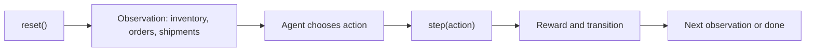

# Warehouse Order Orchestrator

Warehouse Order Orchestrator is a real-world OpenEnv benchmark where an AI agent acts as a warehouse operations coordinator. The agent must prioritize urgent orders, manage inventory constraints, decide when to restock, and complete work before deadlines.

## Live Links

- GitHub Repository: https://github.com/Sahilsharma-ss/warehouse-env
- Hugging Face Space: https://huggingface.co/spaces/sharmasahil/warehouse-env
- Runtime Endpoint (for API checks): https://sharmasahil-warehouse-env.hf.space



## Why This Environment

- Models a genuine logistics coordination workflow, not a toy domain.
- Rewards partial progress across the full episode.
- Includes deterministic graders with difficulty progression (easy -> medium -> hard).
- Built for OpenEnv validation, reproducible inference runs, and HF Space deployment.

## OpenEnv Interface

The environment implements the standard `reset()`, `step(action)`, and `state()` pattern through `warehouse_env.environment:WarehouseEnv`.

### Observation Space

Each observation contains:

| Field | Meaning |
| --- | --- |
| `task_id` / `task_name` / `difficulty` | Task metadata |
| `time` / `max_steps` | Current episode clock |
| `inventory` | Available stock by item |
| `active_order` | Current order in progress, if any |
| `pending_orders` | Orders still awaiting fulfillment |
| `incoming_shipments` | Restocks scheduled to arrive later in the episode |
| `metrics` | Running progress and score-oriented ratios |

### Action Space

The agent can choose one of four actions:

| Action | Required fields | Purpose |
| --- | --- | --- |
| `start_order` | `order_id` | Reserve inventory and begin processing an order |
| `expedite_order` | `order_id` | Reduce the remaining work on the active order |
| `restock_item` | `item`, `quantity` | Schedule replenishment for a missing SKU |
| `wait` | none | Advance time without new work |

## Tasks and Grading

Three deterministic tasks are included with increasing planning pressure:

| Task | File | Difficulty | Core challenge |
| --- | --- | --- | --- |
| Morning Shift Triage | `tasks/easy.json` | Easy | Complete all orders with comfortable inventory and deadlines |
| Cross-Dock Priority Routing | `tasks/medium.json` | Medium | Blend sequencing with one critical restock decision |
| Same-Day Urgent Fulfillment | `tasks/hard.json` | Hard | Handle scarce stock, deadline pressure, and competing priorities |

Grader output is normalized to the range `0.0` to `1.0` using weighted components:

- Completion ratio
- On-time ratio
- Priority-weighted completion
- Action efficiency (invalid action rate)
- Reward normalization (`reward_floor` to `reward_ceiling`)

## Reward Design

Rewards are shaped across the full trajectory:

| Signal | Effect |
| --- | --- |
| Starting an order | Small positive signal for making progress |
| Active processing | Per-step progress reward |
| On-time completion | Completion bonus plus timeliness bonus |
| Late completion | Lower completion value plus lateness penalty |
| Restocking | Small cost, plus delayed inventory arrival |
| Invalid actions | Clear penalty |
| Waiting | Small cost to discourage loops |

## Quick Start

### 1) Install

```bash
pip install -r requirements.txt
```

### 2) Run Baseline

```bash
python inference.py
```

The baseline script (`inference.py`) emits strict structured logs:

- `[START]`
- `[STEP]`
- `[END]`

### 3) Configure Environment Variables

For submission and hosted evaluation:

- `API_BASE_URL`
- `MODEL_NAME`
- `HF_TOKEN`

Defaults are set only for `API_BASE_URL` and `MODEL_NAME`; `HF_TOKEN` has no default.

If credentials are missing, the script falls back to a deterministic heuristic policy so local execution remains reproducible.

### 4) Container Run

```bash
docker build -t openenv-warehouse .
docker run --rm -p 7860:7860 openenv-warehouse
```

## Deployment and Runtime API

This repo is packaged for Hugging Face Docker Spaces.

Evaluator-friendly runtime endpoints:

- `GET /health`
- `GET /reset` or `POST /reset` with optional `{ "task_id": "..." }`
- `POST /step` with `{ "action": { ... } }`
- `GET /state` or `POST /state`
- `GET /run` to trigger baseline run from the UI

## Baseline Scores

Run `python inference.py` to reproduce baseline results:

| Task | Score |
| --- | --- |
| Easy | 0.9576 |
| Medium | 0.9081 |
| Hard | 0.7730 |
| Average | 0.8796 |

## Project Structure

| Path | Purpose |
| --- | --- |
| `warehouse_env/models.py` | Typed Pydantic models |
| `warehouse_env/environment.py` | Core OpenEnv environment (`reset/step/state`) |
| `warehouse_env/grader.py` | Deterministic task grading to `0.0-1.0` |
| `tasks/` | Easy, medium, hard task definitions |
| `inference.py` | Baseline evaluation script with strict logs |
| `app.py` | Space web app and API routing |
| `server/app.py` | Multi-mode server script entrypoint |
| `openenv.yaml` | OpenEnv metadata |
| `pyproject.toml` + `uv.lock` | Packaging and lock metadata for validator checks |

## Submission Checklist Alignment

- OpenEnv API behavior available in Space runtime (`reset/step/state`).
- Dockerfile at repository root.
- `inference.py` at repository root with structured logs.
- Required env var pattern aligned (`API_BASE_URL`, `MODEL_NAME`, `HF_TOKEN`).
- Multi-mode validator files included (`pyproject.toml`, `uv.lock`, `server/app.py`, script entrypoint).

This project is ready for judge interaction through both repository checks and live Space runtime checks.

